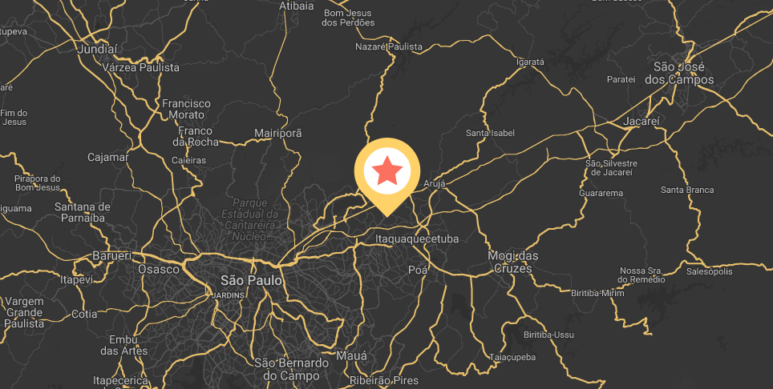

# Custom Map
> Control options and customization of the Google Maps colors, just 1,9 KB.
<center>
  
</center>

### Install

```bash
bower install cMap --save
```

After installing, include the scripts in html.

```html
<script src="bower_components/cMap/dist/cMap.min.js"></script>
```

### Wrapper map need be something like:

```html
<div id="map"></div>
```

### Starting map
```js
var map = new cMap(options);
```

### Options

Option | Type | Description | Example    | Required
------ | ---- | ----------- | -----------|------------
wrapperId | string | Container id map | 'map' | true
Key | string | Google API Key | ['api_key'](https://developers.google.com/maps/documentation/javascript/get-api-key) | true
pinLat | number | pin latitude | -23.562353 | true
pinLng | number | pin latitude | -46.503113 | true
mapLat | number | map latitude | -23.562353 | true
mapLng | number | map latitude | -46.503113 | true
styles | array | google styles | [{},{}] | true
name | string | Map name | 'cMap' | false
icon | string | url to pin the way | 'imgs/pin.png' | false
zoom | number | Initial zoom map | 16 | false
zoomControl | boolean | Manual zoom control | true | false
scrollwheel | boolean | Mouse scroll for zoom | false | false
mapTypeControl | boolean | Choose the map type in the upper left corner | true | false
draggable | boolean | If this option is false the map can not be dragged | true | false
streetView | boolean | Control street view | false | false


### Usage

```js
// *Example* Code that was exported from Styled Maps Wizard or Snazzy Maps
var styles = [{"featureType":"all","elementType":"labels","stylers":[{"visibility":"on"}]} ...];

var map = new cMap({
  'name': 'cMap',
  'wrapperId':'map',
  'pinLat': -23.562353,
  'pinLng': -46.503113,
  'mapLat': -23.562353,
  'mapLng': -46.503113
  'styles': styles,
  'key': 'YOUR_API_KEY'
});
```

#### Style

Use the [Styled Maps Wizard](http://googlemaps.github.io/js-samples/styledmaps/wizard/index.html) or [Snazzy Maps](https://snazzymaps.com) to export a JSON with all possible options and include as a parameter to the cMap.

#### Disclaimer
> In the example folder has an demonstration of everything working if necessary :)